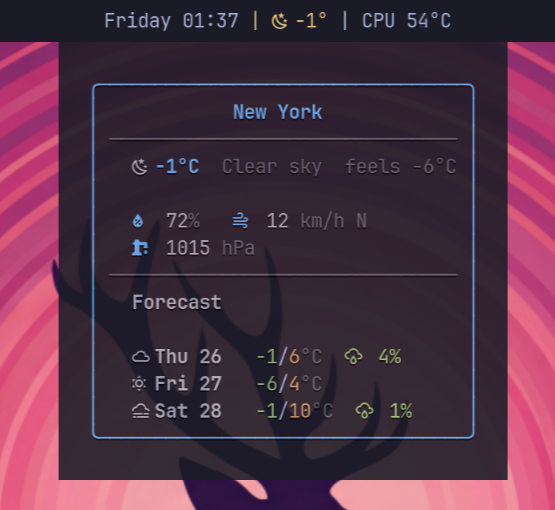

# meteobar

A weather widget for [Waybar](https://github.com/Alexays/Waybar) using [Open-Meteo](https://open-meteo.com/). No API key required.



## Why meteobar?

| Feature | wttrbar | meteobar |
|---|---|---|
| API reliability | wttr.in (frequent downtime) | Open-Meteo (stable, no limits) |
| Offline fallback | None | Disk cache with stale indicator |
| Day/night icons | No | Automatic (current weather) |
| Format customization | Fixed flags | Template strings with placeholders |
| CSS classes | No | Weather-condition based |
| API key required | No | No |

## Installation

### From AUR (Arch Linux)

```bash
yay -S meteobar
```

### From source

```bash
git clone https://github.com/mryll/meteobar
cd meteobar
cargo build --release
cp target/release/meteobar ~/.local/bin/
```

## Quick Start

Add to your Waybar config (`~/.config/waybar/config.jsonc`):

```jsonc
"custom/meteobar": {
    "exec": "meteobar --location 'Buenos Aires'",
    "return-type": "json",
    "interval": 900,
    "tooltip": true
}
```

That's it. You'll see something like `󰖐 23°` in your bar with a full forecast tooltip on hover.

## CLI Options

```
meteobar [OPTIONS]

Options:
  --location <NAME>            City name (e.g., "Buenos Aires"). Auto-detects by IP if omitted.
  --lat <FLOAT>                Latitude (requires --lon)
  --lon <FLOAT>                Longitude (requires --lat)
  --city-name <NAME>           Display name for the location (used with --lat/--lon)
  --format <TEMPLATE>          Bar text template [default: "{icon} {temp}°"]
  --tooltip-format <FORMAT>    Tooltip content: days, hours, both [default: days]
  --days <N>                   Forecast days in tooltip (1-7) [default: 3]
  --hours <N>                  Forecast hours in tooltip (0-24) [default: 0]
  --units <UNITS>              Unit system: metric, imperial [default: metric]
  --icons <SET>                Icon set for bar text: nerd, weather, emoji, fontawesome [default: nerd]
  --cache-dir <PATH>           Cache directory [default: ~/.cache/meteobar]
  --no-cache                   Disable cache
  --timeout <SECS>             HTTP timeout in seconds (1-60) [default: 10]
  --version                    Print version
  --help                       Print help
```

## Template Placeholders

Use these in `--format`:

| Placeholder | Example | Description |
|---|---|---|
| `{icon}` | 󰖙 | Weather icon (nerd font or emoji) |
| `{temp}` | 23 | Current temperature |
| `{feels_like}` | 22 | Feels-like temperature |
| `{humidity}` | 47 | Humidity percentage |
| `{wind}` | 9 | Wind speed |
| `{wind_dir}` | NE | Wind direction (cardinal) |
| `{pressure}` | 1012 | Atmospheric pressure (hPa) |
| `{city}` | Buenos Aires | Location name |
| `{min}` | 13 | Today's minimum temperature |
| `{max}` | 26 | Today's maximum temperature |
| `{rain_chance}` | 5 | Today's precipitation probability (%) |
| `{description}` | Overcast | Weather description |

### Examples

```bash
# Minimal (default)
meteobar --location "Berlin"
# Output: 󰖙 23°

# Detailed
meteobar --location "Berlin" --format "{icon} {temp}° {city} ({description})"
# Output: 󰖙 23° Berlin (Clear sky)

# Temperature range
meteobar --location "Berlin" --format "{icon} {min}/{max}°"
# Output: 󰖙 13/26°

# Weather Icons (Erik Flowers, filled with day/night variants)
meteobar --location "Berlin" --icons weather

# Emoji mode
meteobar --location "Berlin" --icons emoji
# Output: ☀️ 23°

# Font Awesome (requires otf-font-awesome >= 7.0.0)
# Icons are automatically wrapped in Pango markup for correct rendering
meteobar --location "Berlin" --icons fontawesome
```

## CSS Classes

meteobar emits CSS classes you can use in `style.css`:

| Class | Condition |
|---|---|
| `clear` | Clear sky / mainly clear |
| `cloudy` | Partly cloudy / overcast |
| `rainy` | Rain / drizzle |
| `snowy` | Snow |
| `stormy` | Thunderstorm |
| `foggy` | Fog / mist |
| `stale` | Cached data (API unreachable) |
| `error` | Total failure |

Multiple classes can be active at once (e.g., `["cloudy", "stale"]`).

### Example CSS

```css
#custom-meteobar.clear { color: #e5c07b; }
#custom-meteobar.rainy { color: #81a1c1; }
#custom-meteobar.snowy { color: #88c0d0; }
#custom-meteobar.stormy { color: #bf616a; }
#custom-meteobar.stale { opacity: 0.6; }
```

## Waybar Config Examples

### Minimal

```jsonc
"custom/meteobar": {
    "exec": "meteobar --location 'Tokyo'",
    "return-type": "json",
    "interval": 900,
    "tooltip": true
}
```

### With format and emoji

```jsonc
"custom/meteobar": {
    "exec": "meteobar --location 'New York' --icons emoji --format '{icon} {temp}° {description}'",
    "return-type": "json",
    "interval": 900,
    "tooltip": true
}
```

### Imperial units with hourly forecast

```jsonc
"custom/meteobar": {
    "exec": "meteobar --location 'London' --units imperial --tooltip-format both --hours 6",
    "return-type": "json",
    "interval": 900,
    "tooltip": true
}
```

### Auto-detect location by IP

```jsonc
"custom/meteobar": {
    "exec": "meteobar",
    "return-type": "json",
    "interval": 900,
    "tooltip": true
}
```

## How It Works

1. Resolves location (from `--location`, `--lat/--lon`, or auto-detect by IP via [ipapi.co](https://ipapi.co/))
2. Fetches weather data from [Open-Meteo](https://open-meteo.com/) (free, no API key)
3. Caches the response to `~/.cache/meteobar/last.json`
4. If the API is unreachable, falls back to cached data (with `stale` CSS class)
5. Outputs JSON that Waybar consumes (`text`, `tooltip`, `class`, `alt`)

**Note:** The tooltip always uses Nerd Font icons for consistent monospace alignment, regardless of the `--icons` setting. The `--icons` flag controls the bar text only.

**Theming:** Tooltip colors are automatically detected from the active [Omarchy](https://github.com/pablopunk/omarchy) theme (`~/.config/omarchy/current/theme/colors.toml`). When not running on Omarchy, One Dark colors are used as fallback.

## License

MIT
